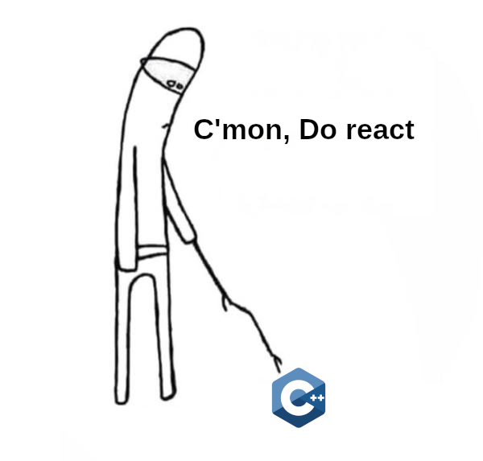

# µReact benchmark

Feature comparison and benchmarking of reactive libraries for c++

Libraries to compare:

* [µReact](https://github.com/YarikTH/ureact)
* [cpp.react](https://github.com/snakster/cpp.react). It has 2 branches - master and legacy1
* [usingstdcpp2019::urp](https://github.com/joaquintides/usingstdcpp2019)
* [observable](https://github.com/ddinu/observable)
* [RxCpp](https://github.com/ReactiveX/RxCpp)
* [another-rxcpp](https://github.com/CODIANZ/another-rxcpp)
* [ReactivePlusPlus](https://github.com/victimsnino/ReactivePlusPlus)
* [CXXIter](https://github.com/seijikun/CXXIter)
* [DSPatch](https://github.com/cross-platform/dspatch)
* [tower120/reactive](https://github.com/tower120/reactive)
* [cpp-react](https://github.com/edvorg/cpp-react)
* [REACT-CPP](https://github.com/CopernicaMarketingSoftware/REACT-CPP) irrelevant
* [ldionne/react](https://github.com/ldionne/react)
* [TensorFlow](https://github.com/tensorflow/tensorflow) hard to build
* [zug](https://github.com/arximboldi/zug)
* [lager](https://github.com/arximboldi/lager)
* [sodium](https://github.com/SodiumFRP/sodium)
* [KDBindings](https://github.com/KDAB/KDBindings)

Additional foreign language libraries to see the contents and features:

* https://github.com/gelisam/frp-zoo (comparasion of haskel reactive libraries and their features. Generally like this repo tried to do)
* https://github.com/IgorBuchelnikov/ObservableComputations
* https://reactjs.org/
* https://docs.racket-lang.org/frtime/
* https://www.uwanttolearn.com/android/pull-vs-push-imperative-vs-reactive-reactive-programming-android-rxjava2-hell-part2/
* http://jultika.oulu.fi/files/nbnfioulu-201511212160.pdf

It's not quite clear how to compare and benchmark them.

Maybe first step should be adding all of them in this repo one way or another and making they work on some trivial cases.
